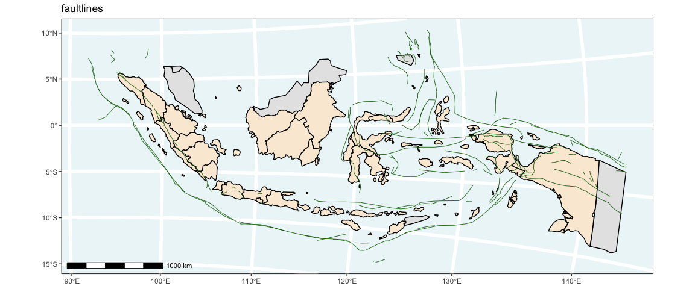
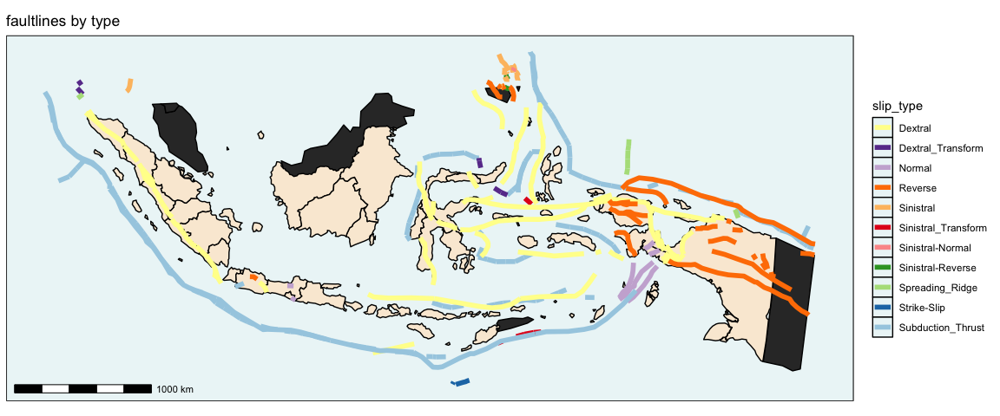
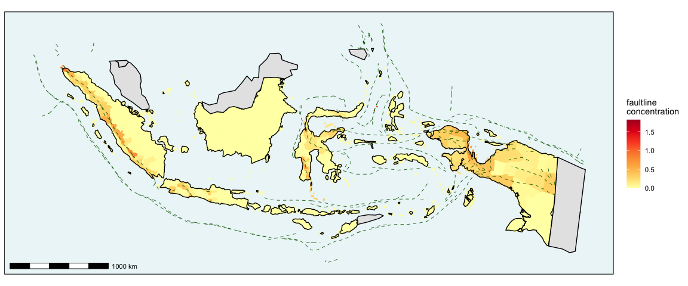
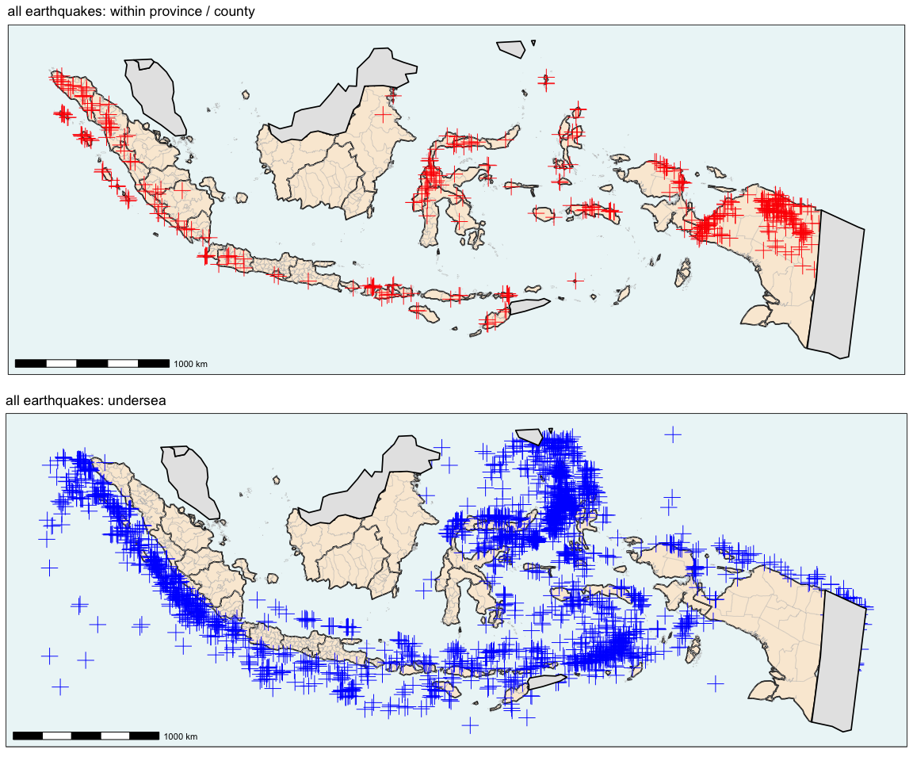
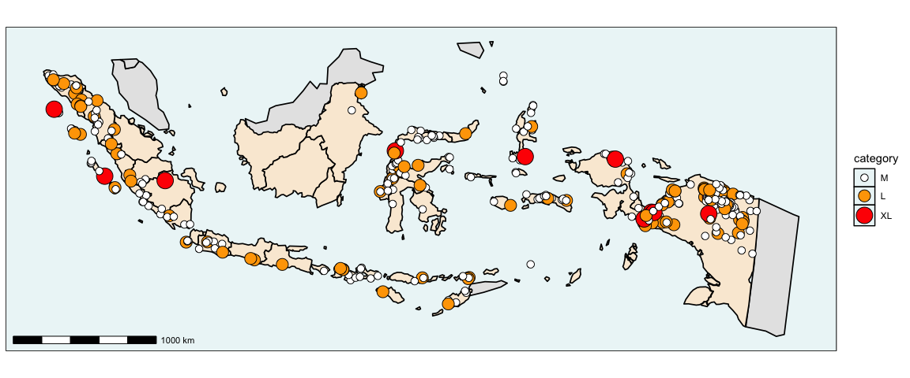
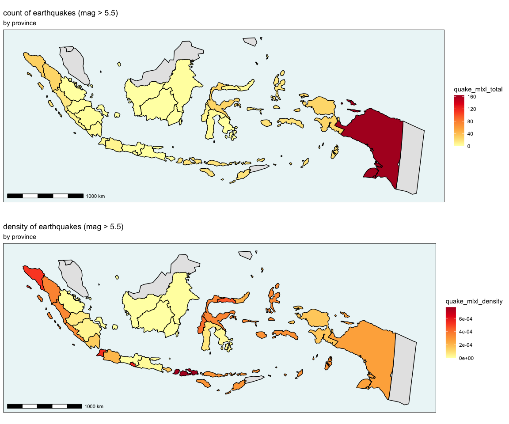
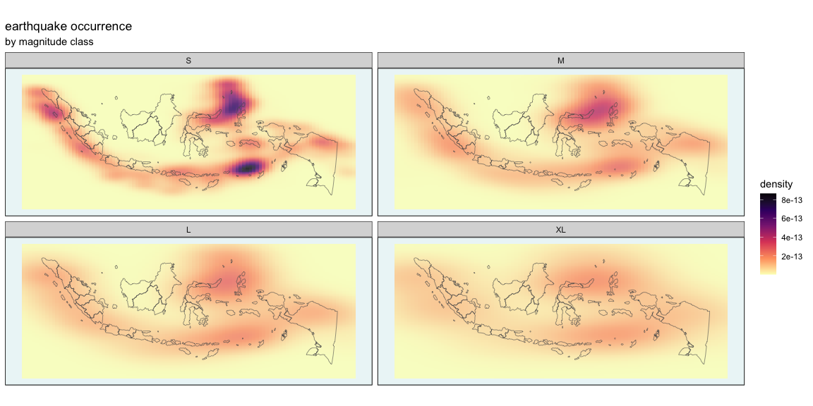

# Indonesia earthquakes datasets

These datasets contain spatio-temporal information about earthquakes in
Indonesia. All five datasets are `sf` dataframes which can be mapped.
**quakes_df** contains records for individual earthquakes.
**provinces_df** contains records for each province, including
aggregations of eathquake counts and densities. **counties_df** contains
the same for lower-level administrative boundaries. **faults_df**
contains linestrings of the faultlines in the area. Finally,
**nearby_countries_df** is a small spatial dataset containing polygons
for the five nearby or bordering countries which are not part of
Indonesia. These can be used when mapping to give more context to the
map.

## Summary

The organisation of the datasets can be summarised as follows:

| dataset                 | summary                                                                                                                                                                                                   |
|-------------------------|-----------------------------------------------------------------------------------------------------------------------------------------------------------------------------------------------------------|
| **quakes_df**           | simple features dataframe containing 67,268 records for all earthquakes \>= 2.5 magnitude from 1 January 1985 to 31 December 2023, with epicentre within bounding box *xmin=92,xmax=143,ymin=-12,ymax=10* |
| **provinces_df**        | simple features dataframe for 33 provinces of Indonesia with details of quakes whose epicentres lay within each zone                                                                                      |
| **counties_df**         | simple features dataframe for 387 kabupaten/kota, here referred to as counties, of Indonesia with details of quakes whose epicentres lay within each zone                                                 |
| **faults_df**           | simple features dataframe for faultlines which lie within bounding box *xmin=92,xmax=143,ymin=-12,ymax=10*                                                                                                |
| **nearby_countries_df** | simple features dataframe of 5 other countries which lie within the same bounding box                                                                                                                     |

## Descripton of datasets

### quakes_df

| attribute        | type      | description                                                                                                                              |
|------------------|-----------|------------------------------------------------------------------------------------------------------------------------------------------|
| id               | character | individual id for each earthquake                                                                                                        |
| ymd              | POSIXct   | year, month, day                                                                                                                         |
| hms              | time      | hour, minute, second                                                                                                                     |
| mag              | numeric   | magnitude of earthquake                                                                                                                  |
| magfact          | factor    | magnitude classified as S, M, L or XL                                                                                                    |
| county           | factor    | name of level-two administrative division where epicentre is located. *undersea* if epicentre is not within Indonesian landmass          |
| county_id        | numeric   | individual id of level-two administrative division where epicentre is located. *undersea* if epicentre is not within Indonesian landmass |
| province         | factor    | name of level-one administrative division where epicentre is located. *undersea* if epicentre is not within Indonesian landmass          |
| province_id      | numeric   | individual id of level-one administrative division where epicentre is located. *undersea* if epicentre is not within Indonesian landmass |
| place            | character | general description of location, where available                                                                                         |
| time             | character | character representation of time                                                                                                         |
| depth            | numeric   | depth of earthquake in kilometres                                                                                                        |
| closest_fault_id | character | id of closest faultline from faults_df dataframe                                                                                         |
| slip_type        | factor    | faulting type of closest faultline from faults_df dataframe                                                                              |
| geometry         | sfc_POINT | points of earthquake epicentres                                                                                                          |

Sourced from the [USGS earthquake catalogue
API](https://earthquake.usgs.gov/earthquakes/search/). More detailed
attribute descriptions available
[here](https://earthquake.usgs.gov/data/comcat/index.php#1).

### provinces_df

| attribute           | type         | description                                                                                                         |
|---------------------|--------------|---------------------------------------------------------------------------------------------------------------------|
| province            | factor       | names of 33 provinces: level-one administrative divisions (Indonesian: *provinsi*)                                  |
| province_id         | numeric      | unique identifier for each province                                                                                 |
| S                   | numeric      | total “small” earthquake count with epicentre within province where magnitude is in the range 2.5 - 5.4             |
| M                   | numeric      | total “medium” earthquake count with epicentre within province where magnitude is in the range 5.5 - 6.0            |
| L                   | numeric      | total “major” earthquake count with epicentre within province where magnitude is in the range 6.1 - 6.9             |
| XL                  | numeric      | total “great” earthquake count with epicentre within province where magnitude is 7 or greater                       |
| quake_total         | numeric      | sum of earthquake count with epicentre within province                                                              |
| quake_density       | numeric      | density of quakes with epicentre within province (total per kilometre squared)                                      |
| quake_mlxl_total    | numeric      | sum of earthquake count with epicentre within province and magnitude 5.5 or greater                                 |
| quake_mlxl_density  | numeric      | density of quakes with epicentre within province and magnitude 5.5 or greater (total per kilometre squared)         |
| area_fault_within   | numeric      | area of faultline within province in kilometres squared (where faultline becomes two-dimensional via a 10km buffer) |
| area_province       | numeric      | area of province in kilometres squared                                                                              |
| fault_concentration | numeric      | area of faultlines within province per square kilometre                                                             |
| geometry            | sfc_GEOMETRY | polygons of provinces                                                                                               |

### counties_df

| attribute           | type         | description                                                                                                                              |
|---------------------|--------------|------------------------------------------------------------------------------------------------------------------------------------------|
| county              | factor       | names of 387 regencies/cities (Indonesian: *kabupaten/kota*): level-two administrative divisions, referred to as counties for simplicity |
| county_id           | numeric      | unique identifier for each county                                                                                                        |
| province            | factor       | names of 33 provinces: level-one administrative divisions (Indonesian: *provinsi*)                                                       |
| province_id         | numeric      | unique identifier for each province                                                                                                      |
| county_type         | factor       | regency or city (Indonesian: *kabupaten/kota*)                                                                                           |
| S                   | numeric      | total “small” earthquake count with epicentre within county where magnitude is in the range 2.5 - 5.4                                    |
| M                   | numeric      | total “medium” earthquake count with epicentre within county where magnitude is in the range 5.4 - 6.1                                   |
| L                   | numeric      | total “major” earthquake count with epicentre within county where magnitude is in the range 6.1 - 7                                      |
| XL                  | numeric      | total “great” earthquake count with epicentre within county where magnitude is 7 or greater                                              |
| quake_total         | numeric      | sum of earthquake count with epicentre within county                                                                                     |
| quake_density       | numeric      | density of quakes with epicentre within county (total per kilometre squared)                                                             |
| quake_mlxl_total    | numeric      | sum of earthquake count with epicentre within county and magnitude 5.4 or greater                                                        |
| quake_mlxl_density  | numeric      | density of quakes with epicentre within county and magnitude 5.4 or greater (total per kilometre squared)                                |
| area_fault_within   | numeric      | area of faultline within county in kilometres squared (where faultline becomes two-dimensional via a 10km buffer)                        |
| area_county         | numeric      | area of county in kilometres squared                                                                                                     |
| fault_concentration | numeric      | area of faultlines within county per square kilometre                                                                                    |
| geometry            | sfc_GEOMETRY | polygons of counties                                                                                                                     |

### faults_df

| attribute  | type      | description               |
|------------|-----------|---------------------------|
| catalog_id | character | gloabal fault ID          |
| catalog_na | character | global fault name         |
| name       | character | name of fault zone        |
| slip_type  | factor    | type of faulting          |
| geometry   | sfg list  | linestrings of faultlines |

Taken from the [GEM Foundation’s](https://www.globalquakemodel.org/)
Global Active Faults Database (GEM GAF-DB), as extracted by [Richard
Styron](https://github.com/cossatot).

Styron, Richard, and Marco Pagani. “The GEM Global Active Faults
Database.” *Earthquake Spectra*, vol. 36, no. 1_suppl, Oct. 2020,
pp. 160–180, <doi:10.1177/8755293020944182>.

<https://journals.sagepub.com/doi/abs/10.1177/8755293020944182>

### nearby_countries_df

For the purposes of context when mapping, the polygons outlines of
neighbouring countries within the bounding-box are provided:

| attribute | type     | description            |
|-----------|----------|------------------------|
| name      | factor   | name of nearby country |
| geometry  | sfg list | polygons of countries  |

## Preparation of datasets

The code for the assembly of these datasets is available in the file
**codeprep.Rmd**.

## Visualisations from datasets

### faults_df

Below is a map of Indonesia, with other neighbouring or bordering
countries filled in grey. The many local faultlines which lie within
300km of the shore are shown as green lines.

<!-- -->

The category of fault is an attribute of **faults_df**:

<!-- -->

#### faultline concentration

To get an interpretable measure of faultline concentration in any area
for use in **provinces_df** and **counties_df**, they are transformed
from linestrings to polygons by setting a buffer of 10km around them, as
shown below. This is now in units of kilometres squared and be compared
with the area of administrative units to give concentrations.

We can subsequently measure what proportion of any administrative unit
is covered by these buffered faultlines.

<!-- -->

### provinces_df

This dataset contains a number of attributes for each province including
counts and concentrations of earthquakes whose epicentres occurred
within that province, and measures of faultline concentration as mapped
below:

<!-- -->

### counties_df

The same can be done by county:

<!-- -->

### quakes_df

The following map shows a random sample of 20,000 (for visualisation
purposes) of the 67,268 earthquakes in **quakes_df** of magnitude \>=
2.5 recorded in the region of Indonesia from 1 January 1985 to 31
December 2023. The faultlines from **faults_df** are also shown:

<!-- -->

#### location

The attributes *province* and *county* give the name of each
province/county where the earthquake was centred, or registers it as
*undersea* if it was not within any landmass.

<!-- -->

#### magnitude

The magnitude scale which measures the amount of energy released by an
earthquake is shown below, and the descriptions of effects are taken
from
<https://www.mtu.edu/geo/community/seismology/learn/earthquake-measure/magnitude/>.

Earthquake magnitude scale:

| magnitude      | effects                                                              | category |
|----------------|----------------------------------------------------------------------|----------|
| 2.5 or less    | usually not felt, but can be recorded by seismograph                 | XS       |
| 2.5 to 5.4     | often felt, but only causes minor damage                             | S        |
| 5.5 to 6.0     | slight damage to buildings and other structures                      | M        |
| 6.1 to 6.9     | may cause a lot of damage in very populated areas                    | L        |
| 7.0 to 7.9     | major earthquake. serious damage                                     | XL       |
| 8.0 or greater | great earthquake. can totally destroy communities near the epicentre | XL       |

**quakes_df** contains records for earthquakes of size **S** and
greater, according to the above table.

Those whose centres occurred under Indonesia’s landmass can be
visualised by size:

<!-- -->

Or, excluding the **S** category:

<!-- -->

#### count and incidence by province:

**provinces_df** and **counties_df** contain records of count and
incidence (or density per square kilometre)

<!-- -->

#### count and incidence by county:

<!-- -->

#### density maps

If we include all earthquakes, both undersea and beneath Indonesia’s
land mass, their counts can be represented as density plots. When
faceted by magnitude, we get the following:

<!-- -->

Or by year:

<!-- -->
