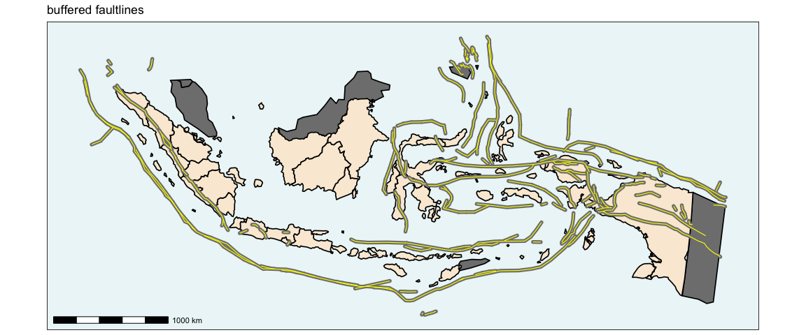
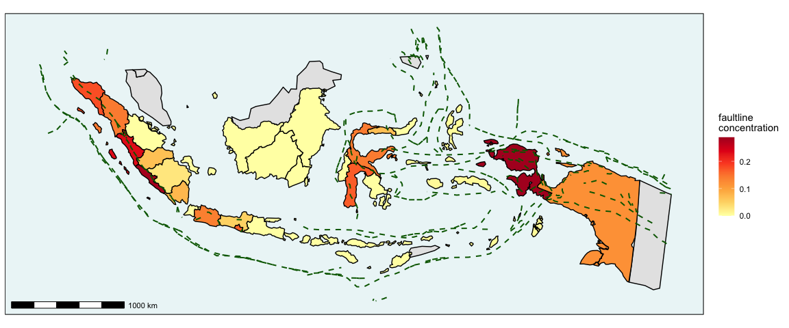
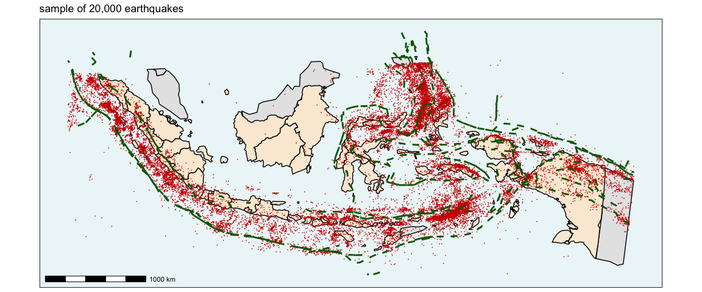
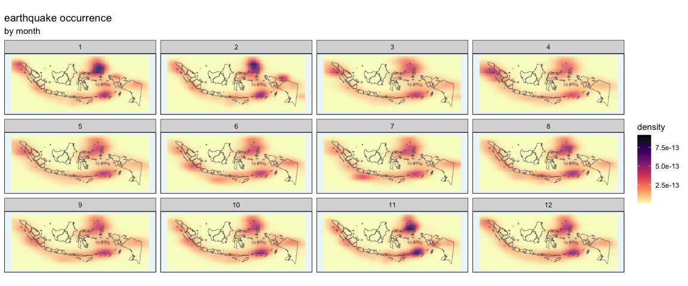

## Indonesia earthquakes datasets

### Summary

The following datasets are contained within this repository:

| dataset                 | summary                                                                                                                                                                                                   |
|-------------------------|-----------------------------------------------------------------------------------------------------------------------------------------------------------------------------------------------------------|
| **quakes_df**           | simple features dataframe containing 67,268 records for all earthquakes \>= 2.5 magnitude from 1 January 1985 to 31 December 2023, with epicentre within bounding box *xmin=92,xmax=143,ymin=-12,ymax=10* |
| **provinces_df**        | simple features dataframe for 33 provinces of Indonesia with details of quakes whose epicentres lay within each zone                                                                                      |
| **counties_df**         | simple features dataframe for 349 kabupaten/kota, here referred to as counties, of Indonesia with details of quakes whose epicentres lay within each zone                                                 |
| **faults_df**           | simple features dataframe for faultlines which lie within bounding box *xmin=92,xmax=143,ymin=-12,ymax=10* or 300km from Indonesia                                                                        |
| **nearby_countries_df** | simple features dataframe of other countries which lie within the same bounding box                                                                                                                       |

### Descripton of datasets

#### quakes_df

67,268…

#### provinces_df

33…

#### counties_df

349…

#### faults_df

263…

#### nearby_countries_df

5…

### Preparation of datasets

They have been assembled as follows:

``` r

# geographic polygons from rnaturalearth

malaysia <- ne_countries(country="malaysia",returnclass = "sf") |> 
  st_set_crs("WGS84") |>
  st_crop(xmin=92,xmax=143,ymin=-12,ymax=6) |> 
  st_transform(23830)
thailand <- ne_countries(country="thailand",returnclass = "sf") |> 
  st_set_crs("WGS84") |>
  st_crop(xmin=92,xmax=143,ymin=-12,ymax=6) |> 
  st_transform(23830)
philippines <- ne_countries(country="philippines",returnclass = "sf") |> 
  st_set_crs("WGS84") |>
  st_crop(xmin=92,xmax=143,ymin=-12,ymax=6) |> 
  st_transform(23830)
papuanewguinea <- ne_countries(country="papua new guinea",returnclass = "sf") |> 
  st_set_crs("WGS84") |>
  st_crop(xmin=92,xmax=143,ymin=-12,ymax=6) |> 
  st_transform(23830)
timorleste <- ne_countries(country="east timor",returnclass = "sf") |> 
  st_set_crs("WGS84") |>
  st_crop(xmin=92,xmax=143,ymin=-12,ymax=6) |> 
  st_transform(23830)

nearby_countries_df <- rbind(malaysia,thailand,philippines,papuanewguinea,timorleste) |> 
  data.frame() |> 
  st_as_sf()
```

``` r

# indonesia level 1 and 2 administrative boundaries from https://bitbucket.org/rifani/geojson-political-indonesia/src/master/

indonesia2 <- st_read(
  "https://bitbucket.org/rifani/geojson-political-indonesia/raw/0e89dcb0b0454c5afffd414fd0cd0c25f1688d10/IDN_adm_2_kabkota.json", 
  quiet=TRUE) |> 
  st_set_crs("WGS84") |> 
  st_transform(23830) |> 
  filter(!is.na(HASC_2)) |> 
  ms_simplify(keep = 0.6)

provinces <- indonesia2 |> 
  ms_dissolve("ID_1",copy_fields = "NAME_1") |> 
  ms_simplify() |> 
  rename(province_id = ID_1,
         province = NAME_1)

counties <- indonesia2 |> 
  ms_dissolve("ID_2") |> 
  left_join(indonesia2 |> select(ID_2,NAME_2,ID_1,NAME_1,ENGTYPE_2) |> st_drop_geometry()) |> 
  rename(county_id = ID_2,
         county = NAME_2,
         province_id = ID_1,
         province = NAME_1,
         county_type = ENGTYPE_2)
```

``` r

# quake data 1985-2023 downloaded from: https://earthquake.usgs.gov/earthquakes/search/
# quakes with minimum magnitude 2.5

quakes_1985_1992 <- read.csv(here("rawdata","query_1985_1992.csv")) |> 
  st_as_sf(coords = c("longitude","latitude"))

quakes_1993_1999 <- read.csv(here("rawdata","query_1993_1999.csv")) |> 
  st_as_sf(coords = c("longitude","latitude"))

quakes_2000_2007 <- read.csv(here("rawdata","query_2000_2007.csv")) |> 
  st_as_sf(coords = c("longitude","latitude"))

quakes_2008_2015 <- read.csv(here("rawdata","query_2008_2015.csv")) |> 
  st_as_sf(coords = c("longitude","latitude"))

quakes_2016_2023 <- read.csv(here("rawdata","query_2016_2023.csv")) |> 
  st_as_sf(coords = c("longitude","latitude"))

quakes <- rbind(quakes_1985_1992,quakes_1993_1999,quakes_2000_2007,quakes_2008_2015,quakes_2016_2023) |>
  data.frame() |>
  st_as_sf() |> 
  mutate(magfact = cut(mag,
                   breaks = c(2.5, 5.4, 6.1, 7, 11),
                   labels = c("S","M","L","XL")), labels=TRUE) |> 
  st_set_crs("WGS84") |> 
  st_crop(xmin=92,xmax=143,ymin=-12,ymax=10) |>
  st_transform(23830) |> 
  mutate(ymd = str_sub(time, start = 1, end = 10)) |> 
  mutate(hms = str_sub(time, start = 12, end = 19)) |> 
  mutate(hms = hms(hms)) |> 
  mutate(ymd = as_datetime(ymd)) |> 
  select(ymd,hms,mag,magfact,place,id,everything())

# index for dataframe: https://earthquake.usgs.gov/data/comcat/index.php#1
```

#### Faultlines

``` r

indonesia_outline <- indonesia2 |> summarise()
indonesia_buffer_outline <- indonesia_outline |> st_buffer(300000)

# faultlines from: https://github.com/cossatot/gem-global-active-faults/tree/master/shapefile
faults <-st_read(here("rawdata","gem_active_faults_harmonized.shp"),
                quiet=TRUE) |> 
  st_crop(xmin=92,xmax=143,ymin=-12,ymax=8) |>
  st_set_crs("WGS84") |>
  st_transform(23830)

faults_df <- faults[st_intersects(indonesia_buffer_outline, faults) |> unlist(),] |> 
  select(catalog_id, catalog_na, name, net_slip_r,slip_type )
```

Below is a map of Indonesia, with other neighbouring or bordering
countries filled in grey. The many local faultlines which lie within
300km of the shore are shown as green lines. This is a particularly
dense region of faults by global standards.

``` r

ggplot() + 
  geom_sf(data=nearby_countries_df, fill="gray90", linewidth=0.5, colour="black") +
  geom_sf(data=provinces, fill="antiquewhite", linewidth=0.5, colour="black") +
  geom_sf(data=faults_df, colour="darkgreen", linewidth=1) +
  guides(fill="none") + 
  annotation_scale() + 
  theme_bw() + 
  theme(panel.background = element_rect(fill = "#ECF6F7", color = "black"),
        panel.grid.major = element_line(colour = "white", linewidth=2))
```

<!-- -->

##### Faultline concentration

Set a buffer around the faultlines of 10km.

``` r

faults_buf <- faults_df |> 
  st_buffer(dist = 10000)

ggplot() + 
  geom_sf(data=nearby_countries_df, fill="gray50", linewidth=0.6, colour="black") +
  geom_sf(data = provinces, fill="antiquewhite", colour="black",linewidth=0.6) +
  geom_sf(data = faults_buf, fill="yellow", colour="gray50",linewidth=0.2) +
  geom_sf(data=faults_df, colour="darkgreen", linewidth=0.5) +
  annotation_scale() +
  coord_sf(datum=NA) + 
  theme(axis.title = element_blank(),
        axis.ticks = element_blank())
```

<!-- -->

###### by province

Ratio of this area to province area.

``` r

faults_within_province <- faults_buf |> 
  st_intersection(provinces) |> 
  mutate(area_fault = as.numeric(st_area(geometry) / 10^6)) |> 
  group_by(province) |> 
  summarise(area_fault_within = sum(area_fault)) |> 
  st_drop_geometry() |> 
  right_join(provinces) |> 
  st_as_sf() |> 
  mutate(area_province = as.numeric(st_area(geometry) / 10^6)) |> 
  mutate(area_fault_within = case_when(is.na(area_fault_within) ~ 0, 
                                       TRUE ~ area_fault_within)) |> 
  mutate(fault_concentration = area_fault_within / area_province)

ggplot() + 
  geom_sf(data=nearby_countries_df, fill="gray90", linewidth=0.5) +
  geom_sf(data=faults_within_province, aes(fill=fault_concentration), linewidth=0.5) +
  geom_sf(data=faults_df, colour="darkgreen", linetype="dashed", linewidth=0.7) +
  scale_fill_distiller(palette = "YlOrRd", direction = 1) + 
  labs(fill="faultline\nconcentration") + 
  annotation_scale() +
  coord_sf(datum=NA)
```

<!-- -->

###### by county

And for county:

``` r

faults_within_county <- faults_buf |> 
  st_intersection(counties) |> 
  mutate(area_fault = as.numeric(st_area(geometry) / 10^6)) |> 
  group_by(county) |> 
  summarise(area_fault_within = sum(area_fault)) |> 
  st_drop_geometry() |> 
  right_join(counties) |> 
  st_as_sf() |> 
  mutate(area_county = as.numeric(st_area(geometry) / 10^6)) |> 
  mutate(area_fault_within = case_when(is.na(area_fault_within) ~ 0, 
                                       TRUE ~ area_fault_within)) |> 
  mutate(fault_concentration = area_fault_within / area_county)

ggplot() + 
  geom_sf(data=nearby_countries_df, fill="gray90", colour="black") +
  geom_sf(data=indonesia_outline, fill=NA, colour="black", linewidth=1) +
  geom_sf(data=faults_within_county[faults_within_county$fault_concentration < 4,], 
          aes(fill=fault_concentration, colour=fault_concentration), linewidth=0.5) +
  geom_sf(data=faults_within_county[faults_within_county$fault_concentration >= 4,], 
          fill="red", colour="red", linewidth=0.5) +
  geom_sf(data=faults_df, colour="darkgreen", linetype="dashed", linewidth=0.3) +
  scale_fill_distiller(palette = "YlOrRd", direction = 1) + 
  scale_colour_distiller(palette = "YlOrRd", direction = 1) + 
  labs(fill="faultline\nconcentration",
       colour="faultline\nconcentration") + 
  annotation_scale() +
  coord_sf(datum=NA)
```

<!-- -->

#### Earthquakes

``` r

quakes_land <- st_join(provinces, quakes, join = st_contains) |>
  st_drop_geometry() |>
  left_join(quakes) |>
  st_as_sf() |> 
  filter(!is.na(magfact))

quakes_df <- left_join(quakes, quakes_land |> st_drop_geometry()) |> 
  mutate(province = case_when(is.na(province) ~ "undersea",
                              TRUE ~ province)) |> 
  st_join(counties |> select(county, county_id), st_within) |> 
  mutate(county = case_when(is.na(county) ~ "undersea",
                              TRUE ~ county)) |> 
  st_join(faults_df |> select(catalog_id, slip_type), st_nearest_feature) |> 
  mutate(closest_fault_id = catalog_id) |> 
  select(id,ymd,hms,mag,magfact,county,county_id,province,province_id,everything(),-labels)

quakes_sea <- quakes_df |> filter(province == "undersea")

quakes_mlxl_land <- quakes_df |> 
  filter(!magfact %in% c("S")) |> 
  filter(province != "undersea") |> 
  filter(!is.na(magfact))

quakes_mlxl_sea <- quakes_df |> 
  filter(!magfact %in% c("S")) |> 
  filter(province == "undersea") |> 
  filter(!is.na(magfact))
```

The following map shows a random sample of 20,000 (for visualisation
purposes) of the 67,268 earthquakes of magnitude \>= 2.5 recorded in the
region of Indonesia from 1 January 1985 to 31 December 2023. This data
was downloaded from the United States Geological Survey (USGS) API
(<https://earthquake.usgs.gov/earthquakes/search/>). Earthquakes in
Indonesia clearly tend to occur close to faultlines.

``` r

set.seed(12345)
quakes_sample <- quakes_df[sample(1:nrow(quakes),20000),]

ggplot() + 
  geom_sf(data=nearby_countries_df, fill="gray90", linewidth=0.5, colour="black") +
  geom_sf(data=provinces, fill="antiquewhite", linewidth=0.5,colour="black") + 
  geom_sf(data=quakes_sample, size=0.05, shape=3, colour="red3") +
  geom_sf(data=faults_df, colour="darkgreen", linetype="dashed", linewidth=1) +
  annotation_scale() +
  coord_sf(datum=NA)
```

<!-- -->

The magnitude scale which measures the amount of energy released by an
earthquake is shown below, and the descriptions of effects are taken
from
<https://www.mtu.edu/geo/community/seismology/learn/earthquake-measure/magnitude/>.

Earthquake magnitude scale:

| magnitude      | effects                                                              | category |
|----------------|----------------------------------------------------------------------|----------|
| 2.5 or less    | usually not felt, but can be recorded by seismograph                 | XS       |
| 2.5 to 5.4     | often felt, but only causes minor damage                             | S        |
| 5.5 to 6.0     | slight damage to buildings and other structures                      | M        |
| 6.1 to 6.9     | may cause a lot of damage in very populated areas                    | L        |
| 7.0 to 7.9     | major earthquake. serious damage                                     | XL       |
| 8.0 or greater | great earthquake. can totally destroy communities near the epicentre | XL       |

Many earthquakes are hard to notice without seismographical equipment
and do little or no damage. For this model, we will consider those which
are potentially “damaging”, i.e. with magnitude \> 5.5. There have been
2,513 of these from 1985-2023 and their locations are shown below,
coloured and sized by category.

##### Earthquake count

Next we want to count the number of earthquakes with epicentre within
each province or county. There were 11,153 such events, with 413 having
magnitude \>=5.5. These are shown below:

``` r


ggplot() + 
  geom_sf(data=nearby_countries_df, fill="gray90", linewidth=0.6, colour="black") +
  geom_sf(data=provinces, fill="antiquewhite", colour="black", linewidth=0.6) + 
  geom_sf(data=counties, fill=NA, colour="grey", linewidth=0.1) + 
  geom_sf(data=quakes_land, aes(fill=magfact, colour=magfact, size=magfact), shape=21) +
  scale_fill_manual(values = c("gray90","yellow","orange","red")) +
  scale_size_manual(values = c(1,3,5,7)) +
  labs(fill="category",
       size="category",
       colour="category") + 
  annotation_scale() +
  coord_sf(datum=NA)
```

<!-- -->

``` r

ggplot() + 
  geom_sf(data=nearby_countries_df, fill="gray90", linewidth=0.6, colour="black") +
  geom_sf(data=provinces, fill="antiquewhite", colour="black", linewidth=0.6) + 
  geom_sf(data=quakes_mlxl_land, aes(fill=magfact, size=magfact), shape=21, colour="black") +
  scale_fill_manual(values = c("white","orange","red")) +
  scale_size_manual(values = c(3,5,7)) + 
  labs(fill="category",
       size="category") + 
  annotation_scale() +
  coord_sf(datum=NA)
```

<!-- -->

For simplicity, and dividing earthquakes into those with epicentre on
land and undersea, ignoring representation of magnitude we have:

``` r

ggarrange(
  
  ggplot() + 
  geom_sf(data=nearby_countries_df, fill="gray90", linewidth=0.6, colour="black") +
  geom_sf(data=provinces, fill="antiquewhite", colour="black", linewidth=0.6) + 
  geom_sf(data=counties, fill=NA, colour="grey", linewidth=0.1) + 
  geom_sf(data=quakes_mlxl_land, colour="red", shape=3, colour="black", size=5) +
  scale_fill_distiller(direction = 1, palette = "YlOrRd") + 
  scale_fill_manual(values = c("white","orange","red")) + 
  scale_size_manual(values = c(3,5,7)) + 
  labs(fill="category",
       size="category") + 
  annotation_scale() +
  coord_sf(datum=NA),
  
  ggplot() + 
  geom_sf(data=nearby_countries_df, fill="gray90", linewidth=0.6, colour="black") +
  geom_sf(data=provinces, fill="antiquewhite", colour="black", linewidth=0.6) + 
  geom_sf(data=counties, fill=NA, colour="grey", linewidth=0.1) + 
  geom_sf(data=quakes_mlxl_sea, colour="blue", shape=2, colour="black", size=1, alpha=0.8) +
  scale_fill_distiller(direction = 1, palette = "YlOrRd") + 
  scale_fill_manual(values = c("white","orange","red")) + 
  scale_size_manual(values = c(3,5,7)) + 
  labs(fill="category",
       size="category") + 
  annotation_scale() +
  coord_sf(datum=NA),
  
  nrow = 2
)
```

<!-- -->

###### by province

Then we could add these up to get the following counts of earthquakes
\>5.5 in magnitude within each province since 1985:

``` r

temp_df <- left_join(provinces, quakes_land |> st_drop_geometry()) |>
  select(province,depth,mag,magfact) |>
  na.omit() |>
  st_drop_geometry() |>
  group_by(province,magfact) |>
  summarise(count=n()) |>
  left_join(provinces |> select(province,geometry)) |>
  st_as_sf() |>
  pivot_wider(names_from = magfact,
              values_from = count) 

provinces_df <- left_join(provinces, temp_df |> st_drop_geometry()) |> 
  mutate(S = case_when(is.na(S) ~ 0, TRUE ~ S), 
         M = case_when(is.na(M) ~ 0, TRUE ~ M), 
         L = case_when(is.na(L) ~ 0, TRUE ~ L), 
         XL = case_when(is.na(XL) ~ 0, TRUE ~ XL)) |> 
  mutate(quake_total = S+M+L+XL) |>
  mutate(quake_density = quake_total / as.numeric(st_area(geometry))) |> 
  mutate(quake_mlxl_total = M+L+XL) |>
  mutate(quake_mlxl_density = quake_mlxl_total / as.numeric(st_area(geometry) / 10^6)) |> 
  left_join(faults_within_province |> st_drop_geometry()) |> 
  arrange(province)
```

Obviously, some provinces are much larger than others and what we are
actually more interested in is the relative incidence per unit area
(square kilometre) for each province (the total count divided by the
area). This changes the look of the map somewhat with the large province
of Papua having less extreme values than by raw count. Aceh, Banten and
Bali now stand out more in terms of relative incidence.

``` r

ggarrange(
  
  ggplot() +
  geom_sf(data=nearby_countries_df, fill="gray90", colour="black") +
  geom_sf(data=provinces_df, aes(fill=quake_mlxl_total)) +
  scale_fill_distiller(palette = "YlOrRd", direction = 1) + 
  labs(fill="quake_mlxl_total") + 
  annotation_scale() +
  coord_sf(datum=NA),
  
  ggplot() +
  geom_sf(data=nearby_countries_df, fill="gray90", colour="black") +
  geom_sf(data=provinces_df, aes(fill=quake_mlxl_density)) +
  scale_fill_distiller(palette = "YlOrRd", direction = 1) + 
  labs(fill="quake_mlxl_density") + 
  annotation_scale() +
  coord_sf(datum=NA) + 
  theme(axis.title = element_blank(),
        axis.ticks = element_blank()),
  
  nrow = 2
)
```

<!-- -->

###### by county

``` r

temp_df <- st_join(counties, quakes_land, st_contains) |>
  select(county_id,depth,mag,magfact) |>
  na.omit() |>
  st_drop_geometry() |>
  group_by(county_id,magfact) |>
  summarise(count=n()) |>
  left_join(counties |> select(county_id,geometry), by="county_id") |>
  st_as_sf() |>
  pivot_wider(names_from = magfact,
              values_from = count) 

counties_df <- left_join(counties, temp_df |> st_drop_geometry(), by="county_id") |> 
  mutate(S = case_when(is.na(S) ~ 0, TRUE ~ S), 
         M = case_when(is.na(M) ~ 0, TRUE ~ M), 
         L = case_when(is.na(L) ~ 0, TRUE ~ L), 
         XL = case_when(is.na(XL) ~ 0, TRUE ~ XL)) |> 
  mutate(quake_total = S+M+L+XL) |>
  mutate(quake_density = quake_total / as.numeric(st_area(geometry))) |> 
  mutate(quake_mlxl_total = M+L+XL) |>
  mutate(quake_mlxl_density = quake_mlxl_total / as.numeric(st_area(geometry) / 10^6)) |> 
  left_join(faults_within_county |> 
              select(county_id,area_fault_within,area_county,fault_concentration) |> 
              st_drop_geometry(), by="county_id") |> 
  arrange(county)
```

``` r

ggarrange(
  
  ggplot() +
  geom_sf(data=nearby_countries_df, fill="gray90", colour="black", linewidth=0.4) +
  geom_sf(data=indonesia_outline, fill=NA, colour="black", linewidth=1) +
  geom_sf(data=counties_df, aes(fill=quake_mlxl_total, colour=quake_mlxl_total)) +
  scale_fill_distiller(palette = "YlOrRd", direction = 1) + 
  scale_colour_distiller(palette = "YlOrRd", direction = 1) + 
  labs(fill="quake_mlxl_total") + 
  annotation_scale() +
  coord_sf(datum=NA),
  
  ggplot() +
  geom_sf(data=nearby_countries_df, fill="gray90", colour="black", linewidth=0.4) +
  geom_sf(data=indonesia_outline, fill=NA, colour="black", linewidth=1) +
  geom_sf(data=counties_df, aes(fill=quake_mlxl_density, colour=quake_mlxl_density)) +
  scale_fill_distiller(palette = "YlOrRd", direction = 1) + 
  scale_colour_distiller(palette = "YlOrRd", direction = 1) + 
  labs(fill="quake_mlxl_density") + 
  annotation_scale() +
  coord_sf(datum=NA) + 
  theme(axis.title = element_blank(),
        axis.ticks = element_blank()),
  
  nrow = 2
)
```

<!-- -->

## Save datasets

``` r

# saveRDS(quakes_df, here("datasets","quakes_df.rds"))
# saveRDS(provinces_df, here("datasets","provinces_df.rds"))
# saveRDS(counties_df, here("datasets","counties_df.rds"))
# saveRDS(faults_df, here("datasets","faults_df.rds"))
# saveRDS(nearby_countries_df, here("datasets","nearby_countries_df.rds"))
```
